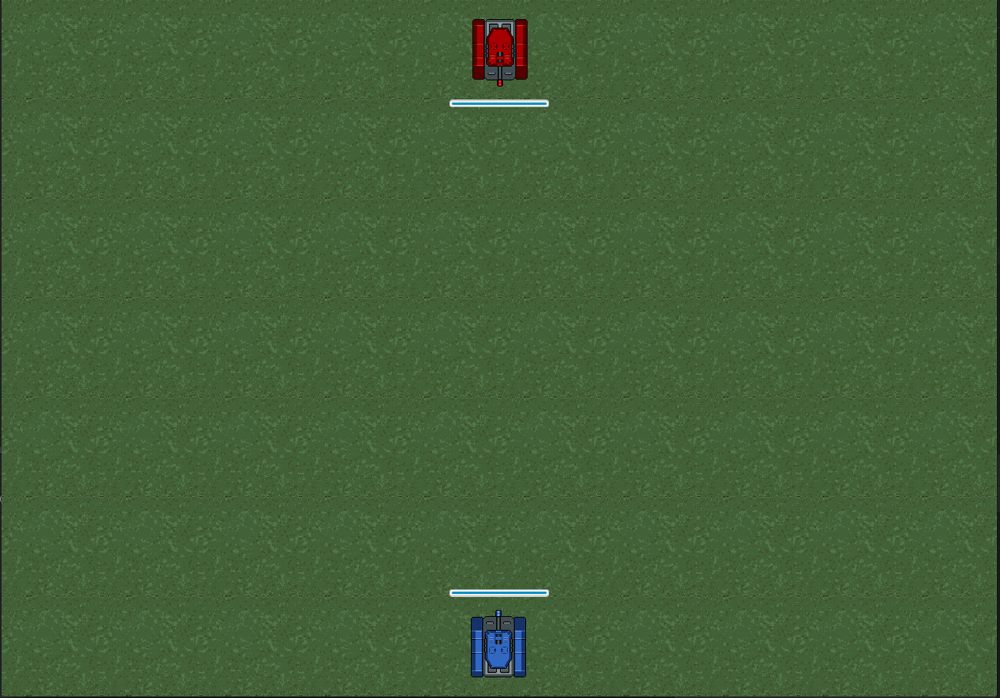

# Tankomahach
Проект представляет собой полноценную клиент-серверную игру написаную на JavaFX.
Каждому из двух игроков предстоит управляя своими танками наносить урон и уничтожить танк противника.
- 
## Игровая механика
1. Танк может двигаться только горизонтально при нажатии клавиш со стрелками влево и вправо. Удержание соответствующей клавиши приводит к непрерывному движению в соответствующем направлении.
2. Танк не может выходить за границы поля.
3. Одиночное нажатие клавиши пробела приводит к одному выстрелу. Невозможно производить серию выстрелов, удерживая клавишу.
4. Попадание в цель уменьшает уровень здоровья врага на 5 единиц.
5. В начале игры у обоих игроков по 100 единиц здоровья.
6. Игрок всегда находится внизу экрана, а враг - вверху.
7. Танки могут двигаться только в том случае, если оба игрока подключены к серверу.

## Дополнительные возможности
- Интерфейс позволяет подключаться к конкретному серверу.
- Когда один из игроков побеждает, появлятется модальное окно со статистикой по выстрелам, попаданиям и промахам.
- Эти статистические данные сохраняются в СУБД на сервере.

## Язык проекта - Java
## Использованные технологии:
- Maven
- JavaFx
- JDBC
- SQL
- Multithreading

### Требуемые доработки
Эту игру можно доробатывать и улучшать, кажется вечно.
