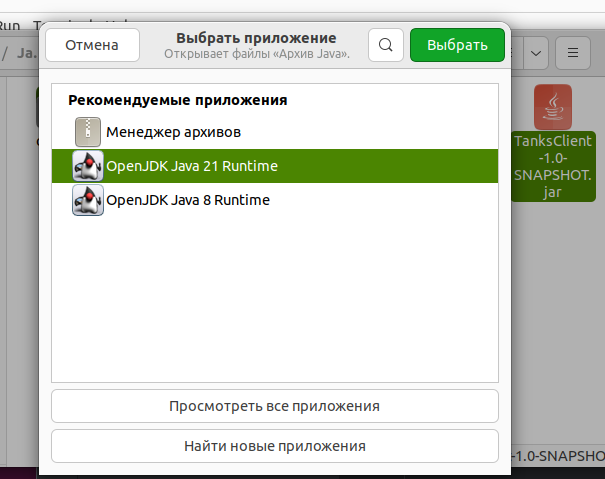

# Инструкция для сборки и запуска приложения.
1. Вызовите команду `mvn clean install` для серверной и клиентской частей.
2. Первым делом запускается серверная часть.
3. Запустите терминал в папке **target** и вызовите команду `chmod +x TanksClient-1.0-SNAPSHOT.jar` тем самым сделаете файл исполняемым.
4. Откройте папку **target** в фаловом менеджере и измените программу для запуска jar приложения на jdk 21, как на скриншоте ниже:
   
5. Теперь двойным кликом по ярлыку jar файла можно запускать игру